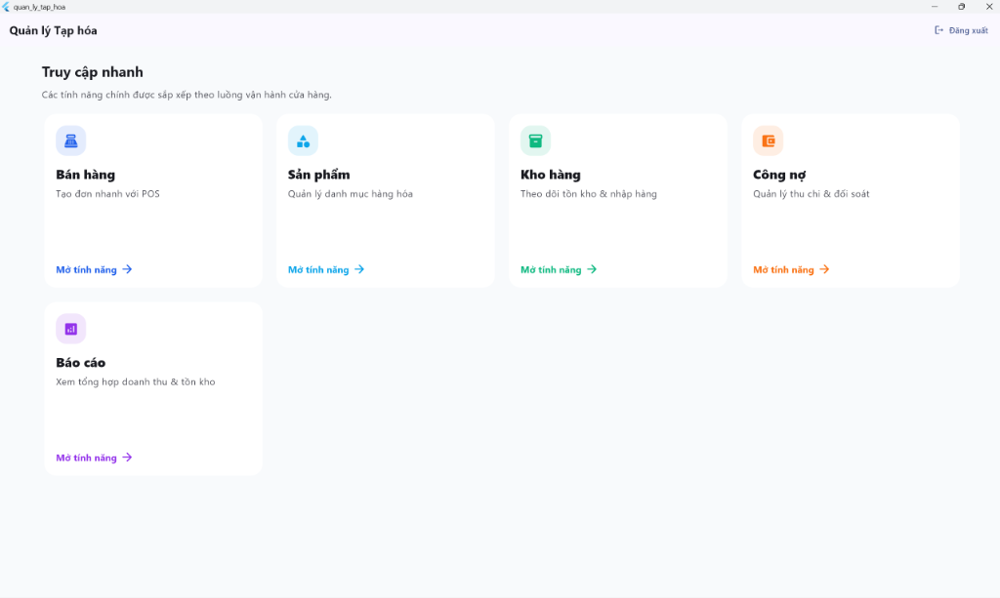

# Phần mềm Quản lý Cửa hàng Tạp hóa

Phần mềm quản lý tạp hóa toàn diện với Flutter + Supabase, hỗ trợ Windows Desktop, Android và iOS.



## 🚀 Tính năng

### ✅ Đã hoàn thành
- **Authentication & Authorization**
  - Đăng nhập/đăng xuất với Supabase Auth
  - Phân quyền theo vai trò (Admin, Manager, Cashier, Warehouse)
  - Ghi nhận lịch sử đăng nhập/đăng xuất
  - Row Level Security (RLS) policies

- **Database Schema**
  - 14 bảng chính với quan hệ đầy đủ
  - Triggers tự động (cập nhật nợ, tạo mã hóa đơn, ghi log)
  - Functions hỗ trợ (FEFO, giá vốn TB, cảnh báo)
  - Views tối ưu (current_inventory)

- **Modules đã hoàn thành**
  - **POS System**: Bán hàng nhanh với tìm kiếm, quét mã vạch, thanh toán QR
  - **Inventory**: Quản lý kho, nhập hàng, theo dõi lô hạn sử dụng (FEFO)
  - **Debt**: Quản lý công nợ khách hàng, ghi nhận thanh toán
  - **Reports**: Báo cáo doanh thu, lợi nhuận và tồn kho trực quan

### 🔨 Đang phát triển
- Real-time Sync (Đồng bộ thời gian thực tối ưu hơn)
- In hóa đơn & Xuất Excel
- Kiểm kho (Stock Take)

## 📋 Yêu cầu hệ thống

- Flutter SDK 3.38.7 trở lên
- Dart 3.10.7 trở lên
- Windows 10/11 (cho phát triển Windows Desktop)
- Tài khoản Supabase (miễn phí)

## 🛠️ Cài đặt

### 1. Clone repository
```bash
git clone <repository-url>
cd quan-ly-tap-hoa
```

### 2. Cài đặt dependencies
```bash
flutter pub get
```

### 3. Cấu hình Supabase

#### a. Tạo project trên Supabase
1. Truy cập [supabase.com](https://supabase.com)
2. Tạo project mới
3. Copy URL và Anon Key

#### b. Cấu hình environment
Tạo file `.env` từ `.env.example`:
```bash
cp .env.example .env
```

Cập nhật thông tin Supabase trong `.env`:
```env
SUPABASE_URL=https://your-project.supabase.co
SUPABASE_ANON_KEY=your-anon-key-here
```

#### c. Chạy SQL scripts
Trong Supabase Dashboard > SQL Editor, chạy các file theo thứ tự:
1. `database/schema.sql` - Tạo bảng và views
2. `database/triggers.sql` - Tạo triggers và functions
3. `database/rls_policies.sql` - Thiết lập RLS policies
4. `database/seed_data.sql` - Dữ liệu mẫu

#### d. Tạo tài khoản admin đầu tiên
1. Trong Supabase Dashboard > Authentication, tạo user mới
2. Copy User ID
3. Chạy SQL:
```sql
INSERT INTO profiles (id, full_name, role_id)
VALUES (
  'your-user-id-here',
  'Admin User',
  (SELECT id FROM roles WHERE name = 'Admin')
);
```

### 4. Chạy ứng dụng

#### Windows Desktop
```bash
flutter run -d windows
```

#### Android
```bash
flutter run -d android
```

#### iOS
```bash
flutter run -d ios
```

## 📁 Cấu trúc thư mục

```
lib/
├── core/
│   ├── constants/       # Hằng số, cấu hình
│   ├── services/        # Services (Supabase, SQLite)
│   ├── models/          # Models dùng chung
│   └── utils/           # Utilities
├── features/
│   ├── auth/           # Authentication
│   ├── pos/            # Point of Sale
│   ├── inventory/      # Quản lý kho
│   ├── debt/           # Quản lý công nợ
│   ├── reports/        # Báo cáo
│   └── staff/          # Quản lý nhân viên
└── main.dart

database/
├── schema.sql          # Database schema
├── triggers.sql        # Triggers & functions
├── rls_policies.sql    # Row Level Security
└── seed_data.sql       # Dữ liệu mẫu
```

## 🔑 Phân quyền mặc định

| Vai trò | Quyền |
|---------|-------|
| **Admin** | Toàn quyền |
| **Manager** | Bán hàng, Quản lý kho, Công nợ, Báo cáo |
| **Cashier** | Chỉ bán hàng, Xem kho (không xem giá vốn) |
| **Warehouse** | Quản lý kho, Kiểm kho |

## 🎯 Tính năng nổi bật

### 1. Weighted Average Costing
Tính giá vốn trung bình tự động khi nhập hàng:
```
Giá vốn mới = (Tồn kho * Giá cũ + Nhập mới * Giá mới) / (Tồn kho + Nhập mới)
```

### 2. FEFO (First Expired, First Out)
Tự động xuất hàng gần hết hạn trước:
- Ưu tiên lô có expiry_date sớm nhất
- Cảnh báo hàng sắp hết hạn (7 ngày)
- Cảnh báo nguy hiểm (3 ngày)

### 3. Dynamic QR Code
Tạo QR code chuyển khoản động theo VietQR:
```
https://img.vietqr.io/image/{bank}-{account}-compact.jpg?amount={amount}&addInfo={description}
```

### 4. Real-time Sync
Đồng bộ tức thì giữa các thiết bị:
- Khi bán hàng → Kho cập nhật ngay
- Khi nhập kho → POS thấy hàng mới
- Khi thu nợ → Công nợ cập nhật

### 5. Offline Support
Hoạt động khi mất mạng:
- Queue transactions trong SQLite
- Auto-sync khi có mạng trở lại
- Conflict resolution

## 📊 Database Schema Highlights

### Inventory Batches
Mỗi lần nhập hàng tạo 1 batch mới với:
- `cost_price`: Giá vốn của lô này
- `expiry_date`: Hạn sử dụng
- `quantity`: Số lượng còn lại

### Sales & Sale Items
- Auto-generate invoice number: `HD{YYYYMMDD}{0001}`
- Track cost_price để tính lãi
- Link với batch_id để FEFO

### Triggers
- `update_customer_debt`: Tự động cập nhật nợ
- `record_sale_stock_movement`: Ghi log xuất kho
- `generate_invoice_number`: Tạo mã hóa đơn

## 🧪 Testing

```bash
# Unit tests
flutter test

# Integration tests
flutter test integration_test/
```

## 📝 TODO

- [x] Implement POS screens
- [x] Implement Inventory screens
- [x] Implement Debt screens
- [x] Implement Reports
- [ ] Add print invoice functionality
- [ ] Add Excel export
- [ ] Add stock take feature
- [ ] Add promotion/discount management

## 🤝 Contributing

Đây là project nội bộ. Liên hệ admin để được cấp quyền.

## 📄 License

Private - All rights reserved

## 📞 Support

Liên hệ: [Your contact info]
